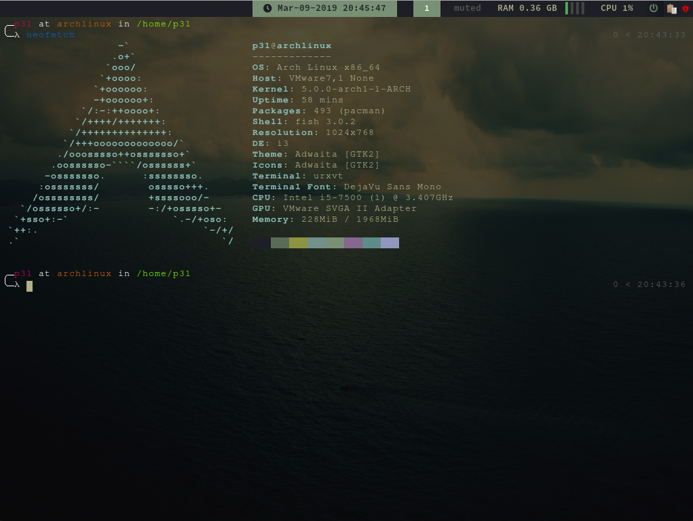

# Auto-Ricing Arch Linux

This project is to bootstrap a fresh Arch Linux installation with all the basic tools I need.  
Inspired by [i3wm-themer](https://github.com/unix121/i3wm-themer), actually, I'm using 004 theme here :)

## Usage

`curl -L https://bit.ly/p31d3ng-ricing -o a.sh && sh a.sh`  
After all installation, please reboot your machine! (or logout and log back in then do `sudo systemctl start lxdm`)

## Screenshots



## Customizations (You can always disable them in YAML)

- Default shell is setting to fish while logging in.b
- Xmodmap for emulating HHKB layout! Once you go HHKB you'll never go back :)
- Using my personal VIMRC which is minimal but with auto-completion.
- Using Emacs keybinding in VS Code with some minor changes. Yes I'm using VIM + Emacs at the same time!

### How to customize your own installation scripts

#### `./post-ricing-tasks`

```
---Exmaple
- name: "vscode-exts"
  description: install extentions for VS Code
  enable: true
  depends: # optional field
    - optional-aur-pkgs
  scripts:
    - loc: "tasks/install_vscode_exts.sh"
      params:  # optional field
        - "packages/vscode-exts"
```

- You can add a new YAML list item to execute any script you want.
- If nothing is at `scripts: - loc`, the task won't run
- If `enable` is set to fasle, the task won't run
- If dependencies are not finished correctly or not executed because of any reason, the task won't run

#### `dotfiles/config.yaml`

```
- name: "Xmodmap"
  action: replace
  config_loc: ~/.Xmodmap
  ref_loc: Xmodmap
  skip_for_vm: true  # optional field
```

- supported actions are:
  - `replace`: it's actually a wrapper of `cp -r`
  - `append`: a wrapper of `cat file >> config`
  - `insert_json`: it will append content to and indent the artifact JSON file.
- `config_loc`: the (config) file that need to be changed or overwritten
- `ref_loc`: location for your custom config file, the base folder is `dotfiles/files`
- `skip_for_vm`: if set to true, the task will not run while in virtual machine

## Packages to be installed

| Required? | Name                        | Description                                                                          | Source |
| --------- | --------------------------- | ------------------------------------------------------------------------------------ | ------ |
| Y         | sudo                        | For adding sudoers                                                                   | pacman |
| Y         | go                          | Dependencies for Yay package manager for AUR, and of course, for the task framework. | pacman |
| Y         | ntp                         | For time/timezone sync                                                               | pacman |
| Y         | dhcp                        | For network address lease                                                            | pacman |
| Y         | git                         | Version control, also critical dependencies for later scripts                        | pacman |
| Y         | base-devel                  | Dependencies for polybar etc.                                                        | pacman |
| Y         | python                      | who don't need python :)                                                             | pacman |
| Y         | python-pip                  | python package manager                                                               | pacman |
| Y         | xorg-server                 | Xorg display server                                                                  | pacman |
| Y         | xorg-xrdb                   | For Xresources, basically for global emacs keybindings                               | pacman |
| Y         | xorg-xrandr                 | For multi-monitor display and resolution adjustment                                  | pacman |
| Y         | xorg-xmodmap                | For remapping keyboarding to my customized HHKB layout                               | pacman |
| Y         | xorg-xdpinfo                | For determining current display resolution                                           | pacman |
| Y         | xorg-xbacklight             | backlight control for laptops                                                        | pacman |
| Y         | networkmanager              | For managing network connections                                                     | pacman |
| Y         | xfce4-power-manager         | For log off/reboot/shutdown                                                          | pacman |
| Y         | i3-gaps                     | i3 window managaer with gaps between windows                                         | pacman |
| Y         | rofi                        | App quick lanucher like Mac Spotlight/Alfred                                         | pacman |
| Y         | rxvt-unicode                | Terminal emulator                                                                    | pacman |
| Y         | adobe-source-code-pro-fonts | fonts                                                                                | pacman |
| Y         | ttf-font-awesome            | fonts                                                                                | pacman |
| Y         | lxdm                        | A fast and lightweight login manager                                                 | pacman |
| Y         | jsoncpp                     | Dependencies for something which I forgot, basically adding json support to cpp      | pacman |
| Y         | ranger                      | File explorer which looks awesome                                                    | pacman |
| Y         | feh                         | Image viewer, also for setting desktop background                                    | pacman |
| Y         | polybar-git                 | status bar for i3 window manager                                                     | AUR    |
| Y         | ttf-nerd-fonts-symbols      | fonts                                                                                | AUR    |
| Y         | pamac-tray-appindicator     | GUI for all installed packages                                                       | AUR    |
| N         | facter                      | For summarize system hardware information                                            | pacman |
| N         | zeal                        | Ofiicial documentation lookup tool for development                                   | pacman |
| N         | fish                        | My favorite shell                                                                    | pacman |
| N         | VIM                         | Yeah I'm a VIM + Emacs user, VIM in terminal and VS Code + Emacs keybindings for dev | pacman |
| N         | jq                          | Terminal JSON query tool                                                             | pacman |
| N         | visual-studio-code-bin      | VS Code :) My personal favorite                                                      | AUR    |
| N         | clipit                      | Pasteboard history management tool                                                   | AUR    |
| N         | lxdm-themes                 | Making LXDM look better                                                              | AUR    |
| N         | firefox                     | browser, basically for DNS-over-HTTPS                                                | AUR    |
| N         | google-chrome               | browser, since firefox does NOT honor gtk keybindings anymore                        | AUR    |

## To-Do

- [ ] go tool to change theme like i3wm-themer
